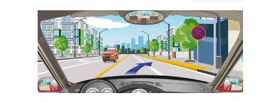
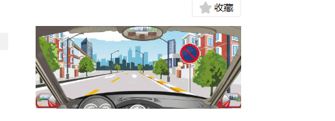
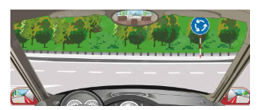
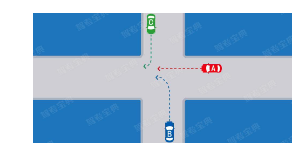
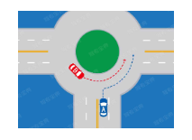
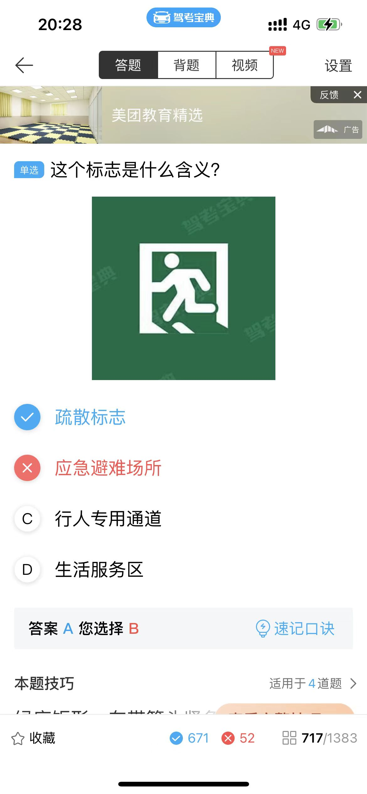

# 科目四

## 错题

应怎样调整汽车座椅安全头枕的高度？

> 头枕支撑部位是**头部**，保护部位是**颈部**！记住！

会车中道路一侧有障碍，双方机动车应怎样做？

> 会车时道路有障碍的一方，要让无障碍的一方先行，不影响无障碍一方的正常行驶
> 下坡让上坡

禁止停车标志

> 两个红叉，禁止停车，一个红斜线，禁止长时间停车！要记清楚，不要混淆
> 禁止一切车辆临时或者长时停放
> 
> 禁止一切车辆长时间停放，临时停车不受限制
> 

环岛标志

驶入不用转向灯，驶出使用右转向灯

路权优先

> 转弯让执行

驾驶机动车起步前，驾驶人对乘车人需提出什么要求？
不选调整好后视镜

转弯让直行，右转让左转，相对方向右转的让左转的

右转让左转,左转让直行    A  

> 路口内的具有优先通行权
> 

口 5 站 3
50米内不得停车

> 交叉路口，铁道路口，急弯路，宽度不足4米的窄路，桥梁，陡坡，隧道50米内路段不得停车
> 加油站 消防站 30米 不准停车

连续开车不能超过4小时

速度题
同方向只有1条机动车道的城市道路每小时50 公里, 公路 每小时 70公里

高速速度
从外到内最低速度依次为 60， 90，110

能见度 小于 50米速度降到 20km/h 尽快离开   520

扇形前 方形后挡风玻璃

下坡不能超车

禁止 里面 有个×的是 禁止停车

蓝底白色是是最低速度

虚线是允许临时停车,实线是允许长时间停车

黑白的标志表示解除速度限制

绿色表示疏散标志

高速的警示牌设置在 **150米**以外
雾天不开远近交替灯
会车在 **150米** 以外，把灯光改为 近光灯
下坡路可以轻拿手刹
